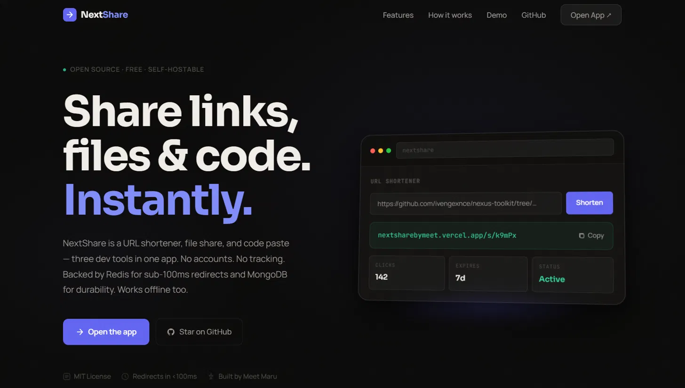
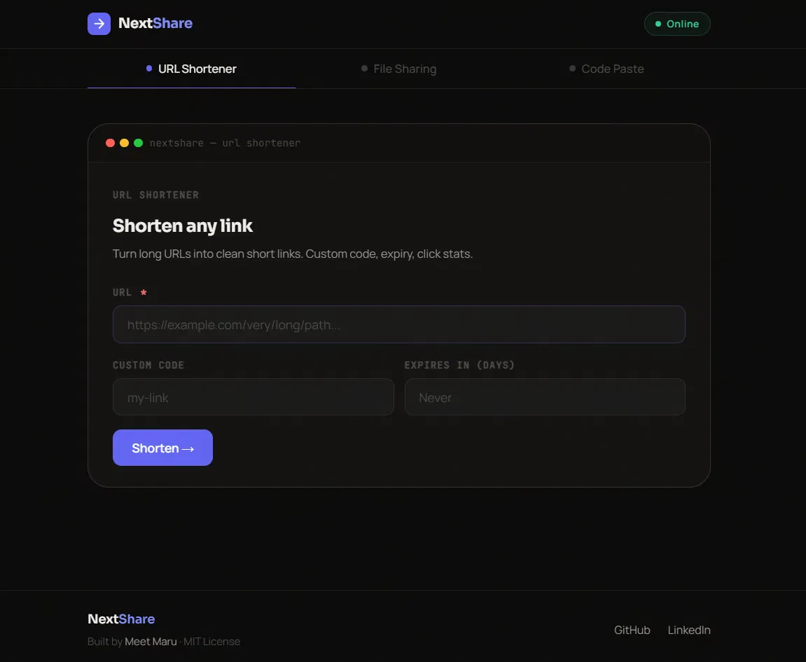
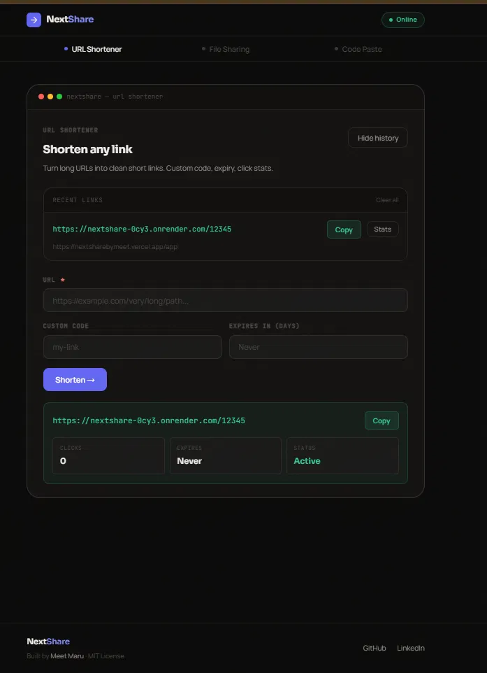
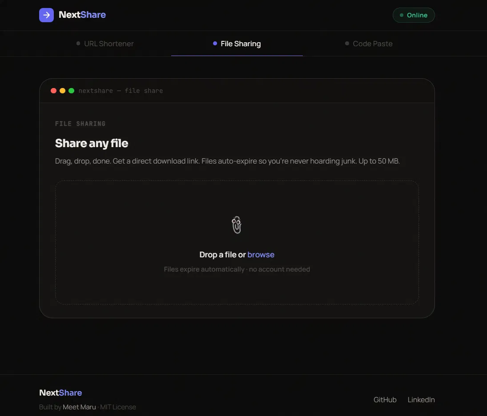
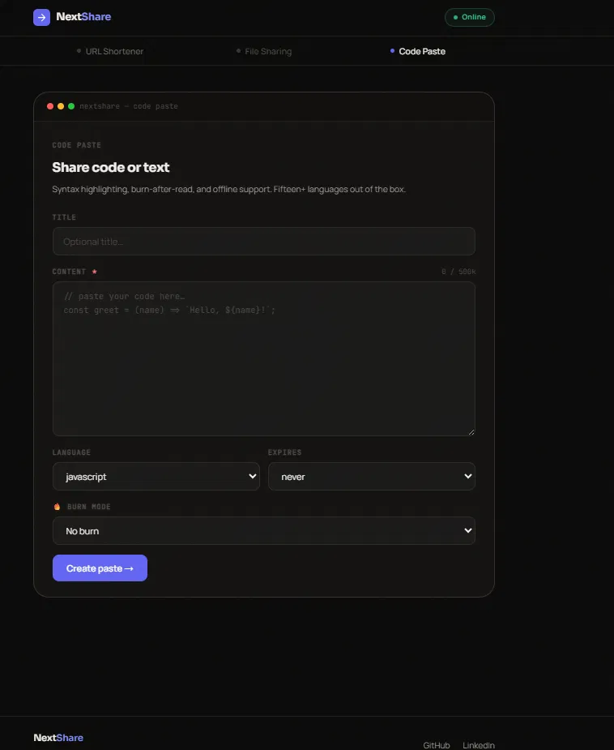
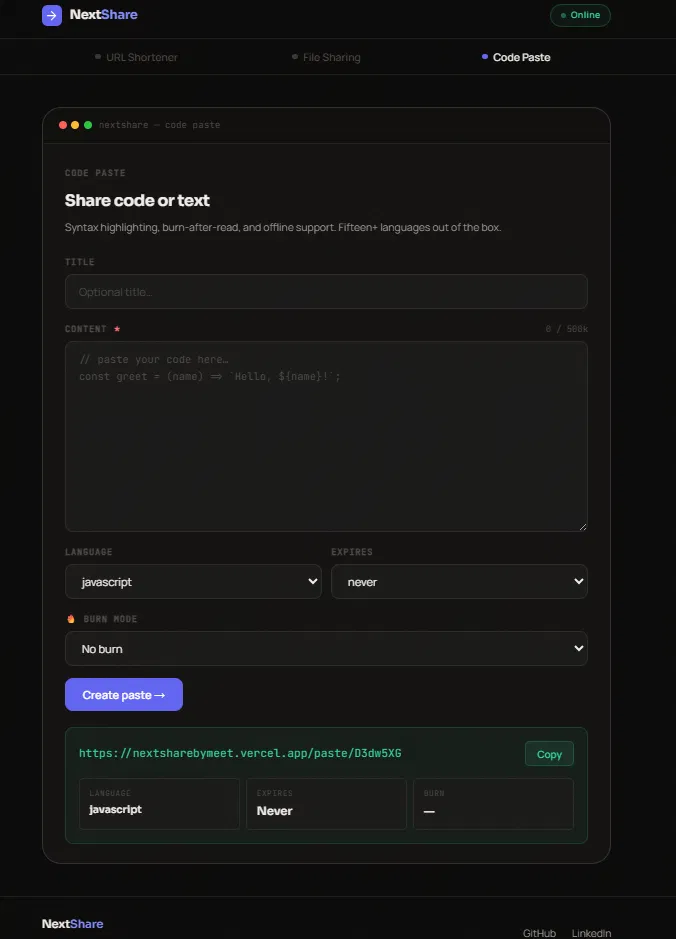

<div align="center">



# 🔗 NextShare — Open Source URL Shortener, File Sharing & Code Paste Tool

**Share links, files & code. Instantly.** No accounts. No tracking.
A free, self-hostable alternative to Bitly, WeTransfer, and Pastebin — three dev tools in one app.

[](https://nextsharebymeet.vercel.app/)
[](LICENSE)
[](https://react.dev)
[](https://nodejs.org)
[](#)
[](https://github.com/ivengexnce/NextShare/stargazers)

**Keywords:** url shortener open source · self hosted link shortener · file sharing app react node · code paste tool · pastebin alternative · bitly alternative · PWA offline file share · MERN stack developer tool

</div>

---

## 📌 Why NextShare?

Most link-shortener and file-sharing tools are closed-source SaaS products with accounts, paywalls, and tracking. **NextShare** skips all of that:

- 🚫 **No accounts, no tracking** — use it instantly, no sign-up wall
- 🆓 **Zero licensing cost** — MIT licensed, self-host anywhere
- ⚡ **Sub-100ms redirects** — Redis-backed, MongoDB for durability
- 📴 **Works offline** — installable PWA with background sync
- 🧱 **Production-grade architecture** — layered backend (controller/service/repository), not a weekend script

---

## ✨ Features

| Feature | Description |
|---|---|
| 🔗 **URL Shortener** | Custom short codes, configurable expiry, live click stats |
| 📁 **File Sharing** | Drag-and-drop uploads up to 50 MB, auto-expiring download links, no account needed |
| 📝 **Code / Text Paste** | 15+ language syntax highlighting, burn-after-read mode, offline support |
| 📊 **Admin Analytics Dashboard** | Owner-only, secret-gated, Chart.js visualizations of traffic |
| 📡 **Unique Visitor Tracking** | Redis Set-based deduplication — accurate, low-overhead analytics |
| 📴 **Offline-First PWA** | IndexedDB caching + background sync, installable on any device |
| 📱 **Fully Responsive UI** | Six breakpoints, hamburger nav, reduced-motion support |
| ⚙️ **Scalable Architecture** | Cache-aside Redis layer, MongoDB source of truth, horizontal-scaling-ready |

---

## 📸 Screenshots

<table>
<tr>
<td width="50%">

**URL Shortener**


</td>
<td width="50%">

**With link history & stats**


</td>
</tr>
<tr>
<td width="50%">

**File Sharing**


</td>
<td width="50%">

**Code / Text Paste**


</td>
</tr>
</table>

<details>
<summary><strong>Code paste result view</strong></summary>
<br/>

</details>

---

## 🖥️ Live Demo

| | |
|---|---|
| 🌐 Landing Page | [nextsharebymeet.vercel.app](https://nextsharebymeet.vercel.app/) |
| 🧰 App | `nextsharebymeet.vercel.app/app` |
| ⚙️ API | Hosted on Render |

---

## 🏗️ Architecture Overview

```
HTTP Request
     │
     ▼
Controller        ← HTTP only. No business logic.
     │
     ▼
Service           ← Business logic. Never touches req/res.
     │
     ▼
Repository        ← Database operations only.
     │
     ▼
Schema / Model    ← Data shape (Mongoose).
```

Strict layer separation across `url`, `files`, and `text` modules. The `admin` module is a deliberate, documented exception — read-only, talking to MongoDB/Redis directly.

---

## 🧱 Tech Stack

| Layer      | Technology                                                       |
|------------|-------------------------------------------------------------------|
| Frontend   | React 18 · Vite 4 · Zustand · IndexedDB (idb)                    |
| Backend    | Node.js 20 · Express 4 · Mongoose 7 · Redis 4                    |
| Database   | MongoDB 7                                                          |
| Cache      | Redis 7 (cache-aside pattern)                                     |
| Deployment | Render (API) · Vercel (Frontend)                                  |
| PWA        | Service Workers · Background Sync · Offline Queue                 |

**Searchable stack tags:** `react` `nodejs` `expressjs` `mongodb` `redis` `vite` `zustand` `pwa` `javascript` `full-stack` `rest-api` `mern-stack`

---

## ⚡ Quick Start

```bash
git clone https://github.com/ivengexnce/NextShare.git
cd NextShare
npm install
```

**Configure environment** — copy `.env.example` → `.env`:

```
MONGODB_URI=
REDIS_URL=
BASE_URL=
FRONTEND_URL=
ADMIN_SECRET=
```

**Run locally:**

```bash
cd apps/api && npm run dev     # backend
cd apps/web && npm run dev     # frontend
```

**Or with Docker:**

```bash
docker compose up
```

---

## 📊 How Analytics Work

Unique visitors are tracked via Redis Sets (not simple counters), giving automatic, memory-efficient deduplication:

| Redis Key | Purpose |
|---|---|
| `visitors:global` | All unique visitors site-wide |
| `visitors:url:{code}` | Unique clicks per short link |
| `visitors:paste:{code}` | Unique views per paste |
| `visitors:file:{code}` | Unique downloads per file |

**Core rule:** MongoDB is the source of truth; Redis is a speed layer. If Redis goes down, the app still works correctly — just slower.

---

## 📈 Built to Scale

NextShare ships with a documented scaling path — not just a demo:

- Cache-aside Redis on any endpoint exceeding 100 req/min
- Async upload queue (Bull) past 20 uploads/min
- Horizontal API scaling with stateless design (shared Redis, no sticky sessions)
- S3-ready file storage migration path for multi-instance deployments
- HyperLogLog fallback for visitor tracking at massive scale

---

## 🗂️ Project Structure

```
NextShare/
├── apps/
│   ├── api/
│   │   ├── src/
│   │   │   ├── config/              # DB, Redis, env config
│   │   │   ├── modules/
│   │   │   │   ├── admin/           # Read-only analytics (controller + routes)
│   │   │   │   ├── files/           # controller · repository · routes · schema · service
│   │   │   │   ├── text/            # controller · repository · routes · schema · service
│   │   │   │   └── url/             # controller · repository · routes · schema · service
│   │   │   ├── shared/
│   │   │   │   ├── errors/          # AppError, errorCodes
│   │   │   │   ├── middleware/      # error, rateLimit, upload, visitor
│   │   │   │   └── utils/           # hash, logger, response.factory
│   │   │   ├── app.js
│   │   │   └── server.js
│   │   └── package.json
│   └── web/
│       ├── public/                  # favicon, PWA icons, manifest
│       ├── src/
│       │   ├── features/
│       │   │   ├── admin/           # AdminDashboard.jsx
│       │   │   ├── files/           # FileShare.jsx + files.api.js
│       │   │   ├── text/            # TextShare.jsx, PasteViewer.jsx + text.api.js
│       │   │   └── url/             # UrlShortener.jsx + url.api.js
│       │   ├── shared/hooks/        # useOffline.js
│       │   ├── store/               # useStore.js, offlineDB.js
│       │   ├── styles/
│       │   ├── App.jsx
│       │   └── main.jsx
│       ├── app.html                 # React SPA entry (mounted at /app)
│       ├── index.html               # Static landing page (mounted at /)
│       ├── vite.config.js
│       └── package.json
├── docker/
│   ├── Dockerfile.api
│   └── docker-compose.yml
├── docs/
│   ├── screenshots/                 # README screenshots
│   ├── AI_SYSTEM_PROMPT.md
│   ├── ARCHITECTURE.md
│   └── SCALING_RULES.md
├── .env.example
├── .gitignore
├── LICENSE
├── package.json
└── package-lock.json
```

---

## ❓ FAQ

### Is NextShare free to use?

**Yes.** NextShare is MIT licensed and completely free to self-host, modify, and fork.

### Do I need an account?

**No.** Every tool works instantly without requiring sign-up or login.

### Can I use this as a Bitly or Pastebin replacement?

**Yes.** NextShare combines URL shortening, secure paste sharing (including burn-after-read), and file sharing in a single self-hosted platform—offering features that neither Bitly nor Pastebin provide together.

### Does it work offline?

**Yes.** NextShare is a Progressive Web App (PWA) with IndexedDB caching and Background Sync, allowing core functionality to work even when you're offline.

### What makes this different from a typical student project?

NextShare is built with production-oriented engineering practices, including:

* Layered architecture (Controller → Service → Repository)
* Redis caching strategy
* Visitor analytics
* Secure authentication and API design
* A documented scaling plan from a single-node deployment to handling **1M+ requests per day**

### Can I deploy this myself?

**Yes.** You can deploy:

* **Backend:** Render or any Node.js hosting provider
* **Frontend:** Vercel or any static hosting platform
* **Local Development:** Docker Compose is included for a consistent development and deployment environment.


---

## 🤝 Contributing

Issues and PRs are welcome. Please follow the existing layer-boundary conventions (controller → service → repository → schema) and keep the frontend ESM-only — no `require()`, it breaks the build on Vercel.

---

## 👤 Author

**Meet Maru** — AI & ML Engineer | Full-Stack Developer | Mumbai, India
Vice President, CSI VIVA · Front-End AI Engineering Intern @ FlyRank

[Portfolio](https://ivengexnce.github.io/portfolio/) · [LinkedIn](https://www.linkedin.com/in/meetmaru149/) · [GitHub](https://github.com/ivengexnce)

---

## 📄 License

MIT © [Meet Maru](https://github.com/ivengexnce) — free to use, modify, and self-host.

---

<div align="center">

⭐ **If NextShare is useful to you, star the repo — it helps others discover it.** ⭐

</div>
